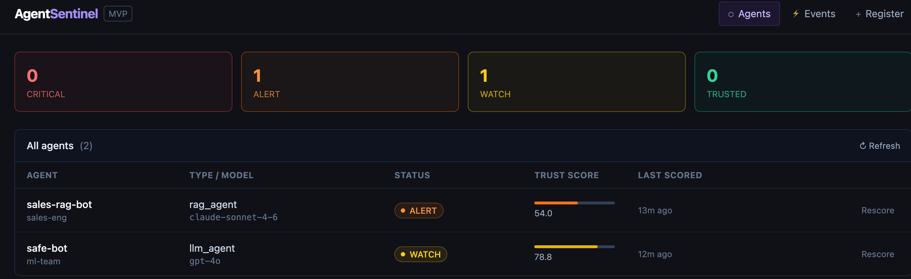

# AgentSentinel

[](LICENSE)

AgentSentinel is an enterprise AI agent security platform that continuously monitors AI agents for over-permissioning and runtime anomalies. It combines static posture analysis (scanning tool grants and MCP server bindings) with live behavior monitoring (baselining tool-call patterns and detecting anomalies) into a single **Trust Score** per agent — giving security teams a unified signal to act on.



---

## Architecture

```
  Agents / Clients
  ─────────────────────────────────────────────────────────────
  ┌──────────────────┐  ┌─────────────────┐  ┌─────────────┐
  │  demo/agent.py   │  │  demo/mcp_shim  │  │  React UI   │
  │  (Claude loop +  │  │  (MCP proxy,    │  │  port 5174  │
  │   SentinelMiddle │  │   zero-touch)   │  │  (dev)      │
  │   ware)          │  │                 │  │             │
  └────────┬─────────┘  └────────┬────────┘  └──────┬──────┘
           │  HTTPS /api/         │                  │ /api/*
           └──────────────────────┘                  │
                        │                            │
  ─────────────────────────────────────────────────────────────
  ┌─────────────────────────────────────────────────────────┐
  │              Nginx (port 443 / TLS termination)          │
  │   HTTP :80 → redirect to HTTPS                          │
  │   nginx/nginx.conf   nginx/certs/server.crt + .key      │
  └──────────────────────┬──────────────────────────────────┘
                         │ proxy_pass http://api:8000
  ─────────────────────────────────────────────────────────────
  ┌─────────────────────────────────────────────────────────┐
  │            FastAPI (internal port 8000)                  │
  │  /api/v1/agents   /api/v1/events   /api/v1/findings     │
  │  /api/v1/agents/{id}/score         /api/v1/agents/{id}/ │
  └──────────────────────┬──────────────────────────────────┘
                         │
            ┌────────────┴────────────┐
            ▼                         ▼
  ┌─────────────────┐       ┌──────────────────┐
  │  POSTURE ENGINE │       │ BEHAVIOR ENGINE  │
  │                 │       │                  │
  │  rules.py       │       │  collector.py    │
  │  scanner.py     │       │  baseline.py     │
  │  scoring.py     │       │  anomaly.py      │
  │  inventory.py   │       │  scoring.py      │
  └────────┬────────┘       └───────┬──────────┘
           │                        │
           └────────────┬───────────┘
                        ▼
              ┌──────────────────┐
              │  TRUST ENGINE    │
              │  engine.py       │
              │  (0.45+0.45+0.10)│
              └────────┬─────────┘
                       │
           ┌───────────┴────────────┐
           ▼                        ▼
  ┌─────────────────┐     ┌──────────────────┐
  │   PostgreSQL 16  │     │   Redis Streams  │
  │   + TimescaleDB  │     │   agent_events   │
  │   (hypertable)   │     └──────────────────┘
  └─────────────────┘
           │
           ▼
  ┌─────────────────┐
  │  Slack Alerts   │
  │  alerts/slack.py│
  │  (CRITICAL only)│
  └─────────────────┘
```

---

## Integrations

| Component | Install | Docs |
|-----------|---------|------|
| **CLI** (`discover` + `scan`) | `pip install "agentsentinel-cli[discover]"` | [Part 5 ↓](#part-5--cli) |
| **LangChain** | `pip install agentsentinel-langchain` | [Part 4 ↓](#part-4--langchain-integration) |

More integrations coming: OpenAI Agents SDK, AWS Bedrock Agents, CrewAI, AutoGen.

---

## Features

### Posture Monitoring
- Detects over-permissioned agents (write/admin grants on read-only agents)
- Flags dormant dangerous grants unused for 30+ days
- Catches data exfiltration paths (internal-read + external-write grant combo)
- Identifies MCP over-connection (>3 external connections with no agent description)
- Spots credential scope mismatches (admin grants with zero calls in the last 7 days)
- Flags dangerous tools with no rate limit configured

### Behavior Monitoring
- Real-time event ingestion pipeline via Redis Streams
- Per-agent/tool baseline builder that learns normal call patterns
- Anomaly scoring with 3-sigma deviation detection
- First-call and no-baseline detection (new agents start scored conservatively)

### Trust Score
- Single score per agent: `(Posture × 45%) + (Behavior × 45%) + (Recency × 10%)`
- Four status bands: **TRUSTED** / **WATCH** / **ALERT** / **CRITICAL**
- Recomputed on every event — always reflects current state

### Alerting
- Slack webhook alerts on CRITICAL findings (configure `SLACK_WEBHOOK_URL` in `.env`)
- Findings feed with severity levels: CRITICAL / HIGH / MEDIUM / LOW
- Findings can be acknowledged or resolved via the API or dashboard

### API & Authentication
- REST API with three key scopes: `admin`, `agent`, `readonly`
- HMAC-SHA256 key hashing with server secret — plaintext is never stored
- Agent-scoped keys are bound to a specific agent — cross-agent event injection is blocked
- Bootstrap admin key generated automatically on first startup

### Dashboard
- Agent list with live trust scores and status badges
- Agent detail: grants, MCP connections, posture findings, score breakdown
- Live event feed with anomaly scores and per-agent filter
- Test event sender for manual demos without a running agent
- Agent and grant registration forms

---

## Quick Reference — Start & Stop Everything

### Start

```bash
# 1. Backend (all services)
docker compose up -d

# 2. Dashboard UI  (new terminal)
cd ui && npm run dev
# → http://localhost:5174

# 3. Demo agent — Claude agentic loop (new terminal, needs ANTHROPIC_API_KEY)
export ANTHROPIC_API_KEY=sk-ant-...
export AGENTSENTINEL_API_KEY=as_adm_...
export SENTINEL_URL=http://localhost:9000
python demo/agent.py

# 4. MCP shim — zero-touch proxy (new terminal, keeps running)
export AGENTSENTINEL_API_KEY=as_adm_...
PYTHONUNBUFFERED=1 python3.11 demo/mcp_shim.py \
    --upstream-cmd "npx -y @modelcontextprotocol/server-filesystem /tmp" \
    --agent-name "my-mcp-agent" \
    --port 8002
```

### Stop

```bash
# Stop the backend (keeps all data)
docker compose down

# Stop the UI dev server
pkill -f "vite"

# Stop the MCP shim or demo agent
# → Press Ctrl+C in the terminal where it is running
```

### Check what's running

```bash
docker compose ps          # backend service status
curl http://localhost:9000/health   # API health
```

---

## Part 1 — Run AgentSentinel

### Prerequisites

- [Docker Desktop](https://www.docker.com/products/docker-desktop/) installed and running
- [Node.js 18+](https://nodejs.org/) (for the UI)
- [Git](https://git-scm.com/)

### Step 1 — Clone the repo

```bash
git clone https://github.com/jaydenaung/agentsentinel.git
cd agentsentinel
```

### Step 2 — Create your `.env` file

```bash
cp .env.example .env
```

The template has three required secrets that must be set before the stack will start. Generate them now:

```bash
# Generate cryptographically random values (run each line separately, copy the output)
openssl rand -hex 24   # → POSTGRES_PASSWORD
openssl rand -hex 24   # → REDIS_PASSWORD
openssl rand -hex 32   # → SECRET_KEY
```

Edit `.env` and replace the three `<generate: ...>` placeholders with the values above. Leave `AGENTSENTINEL_API_KEY` blank — you'll fill it in at Step 6.

### Step 3 — Generate a TLS certificate (first time only)

```bash
./nginx/generate-certs.sh
```

This creates a self-signed cert in `nginx/certs/`. Your browser will show a warning the first time — that's expected for self-signed certs.

### Step 4 — Start Postgres and Redis

```bash
docker compose up -d postgres redis
```

Wait for both to be healthy (about 10 seconds):

```bash
docker compose ps
# Both should show: Up X seconds (healthy)
```

### Step 5 — Run database migrations

Run this once on a fresh database (or after any upgrade):

```bash
docker compose run --rm api alembic upgrade head
```

You should see all four migrations applied:
```
INFO  Running upgrade  -> 0001, Initial schema with TimescaleDB hypertable
INFO  Running upgrade 0001 -> 0002, Add api_keys table
INFO  Running upgrade 0002 -> 0003, Bind agent-scoped API keys to a specific agent_id
INFO  Running upgrade 0003 -> 0004, Invalidate all API keys created before the HMAC-SHA256 hash upgrade
```

### Step 6 — Start the full stack

```bash
docker compose up -d
```

This adds the FastAPI server, the background worker, and Nginx on top of the already-running database services.

### Step 7 — Get your bootstrap API key

On first startup the API generates an admin key and prints it to **stderr**. Retrieve it immediately:

```bash
docker compose logs api 2>&1 | grep -A 4 "BOOTSTRAP ADMIN KEY"
```

You'll see:
```
  AGENTSENTINEL BOOTSTRAP ADMIN KEY
  Copy this now — it will not be shown again.

  as_adm_<your-unique-key>
```

> **Production deployments:** Set `BOOTSTRAP_KEY_FILE=/run/secrets/bootstrap-key` and mount
> a writable secrets volume. The key is written to that file (mode 0600) instead of
> appearing in container logs.

Copy the key and set it in two places:

```bash
# 1. In .env (persistent):
AGENTSENTINEL_API_KEY=as_adm_<your-key-here>

# 2. In your shell (for the curl commands below):
export AGENTSENTINEL_API_KEY=as_adm_<your-key-here>
```

### Step 8 — Verify the backend is working

```bash
curl -s -H "X-API-Key: $AGENTSENTINEL_API_KEY" \
  http://localhost:9000/api/v1/agents | jq .
```

Expected: `[]` (empty list — no agents yet). If you get a 200 response, the backend is healthy.

### Step 9 — Set up the UI

Create `ui/.env` with your API key so the dashboard can authenticate:

```bash
echo "VITE_API_KEY=$AGENTSENTINEL_API_KEY" > ui/.env
```

### Step 10 — Start the UI

In a **new terminal**:

```bash
cd ui
npm install
npm run dev
```

### Step 11 — Open the dashboard

Open **http://localhost:5174** in your browser.

You'll see the AgentSentinel dashboard. It's empty for now — the next section shows you how to get agents appearing with live trust scores.

---

## Shutdown & Restart

### Stop the stack (keeps all data)

Stops all containers but leaves the Postgres volume intact. All agents, events, and findings are preserved.

```bash
# Stop all backend containers
docker compose down

# Stop the UI dev server
pkill -f "vite"
```

### Start the stack again

```bash
# Start the full backend (no migrations needed — already applied)
docker compose up -d

# Start the UI (in a separate terminal)
cd ui && npm run dev
```

---

## Reset

### Soft reset — wipe agents, keep API key

Clears all agents, events, findings, and baselines from the database but keeps your API key intact. Use this to start a clean demo run without a full teardown.

```bash
docker compose exec postgres psql \
  -U ${POSTGRES_USER:-agentsentinel} \
  -d ${POSTGRES_DB:-agentsentinel} \
  -c "TRUNCATE TABLE agent_events, findings, baselines, tool_grants, mcp_connections, agents RESTART IDENTITY CASCADE;"
```

Verify it's clean:

```bash
curl -s -H "X-API-Key: $AGENTSENTINEL_API_KEY" \
  http://localhost:9000/api/v1/agents | jq length
# → 0
```

---

### Hard reset — wipe everything including API key

Destroys the Postgres volume entirely. You will need a new bootstrap key after this.

```bash
# 1. Stop containers and delete the volume
docker compose down -v

# 2. Start Postgres and Redis
docker compose up -d postgres redis

# 3. Run migrations on the fresh database
docker compose run --rm api alembic upgrade head

# 4. Start the full stack
docker compose up -d

# 5. Get your new bootstrap API key
docker compose logs api 2>&1 | grep -A 4 "BOOTSTRAP ADMIN KEY"

# 6. Update .env with the new key
#    AGENTSENTINEL_API_KEY=as_adm_<new-key>

# 7. Update the UI env and restart
echo "VITE_API_KEY=as_adm_<new-key>" > ui/.env
pkill -f "vite" && cd ui && npm run dev
```

---

## Environment Variables

| Variable | Required | Description |
|----------|----------|-------------|
| `POSTGRES_PASSWORD` | **Yes** | PostgreSQL password — generate with `openssl rand -hex 24` |
| `REDIS_PASSWORD` | **Yes** | Redis password — generate with `openssl rand -hex 24` |
| `SECRET_KEY` | **Yes** | Server secret for HMAC key hashing — generate with `openssl rand -hex 32` |
| `POSTGRES_USER` | No | Postgres username (default: `agentsentinel`) |
| `POSTGRES_DB` | No | Database name (default: `agentsentinel`) |
| `DATABASE_URL` | No | Full Postgres connection string (overrides user/pass/db) |
| `REDIS_URL` | No | Redis connection string including password |
| `AGENTSENTINEL_API_KEY` | No | Bootstrap admin key — filled in after first startup |
| `BOOTSTRAP_KEY_FILE` | No | Path to write the one-time bootstrap key (mode 0600). Use a mounted secrets volume in production to prevent the key appearing in container logs. |
| `SENTINEL_ALLOW_WEAK_SECRET` | No | Set to `true` in dev/test to allow the default `SECRET_KEY`. Never set in production. |
| `SHOW_DOCS` | No | Set to `true` to enable `/docs`, `/redoc`, `/openapi.json`. Disabled by default — the OpenAPI schema is a reconnaissance resource. |
| `SLACK_WEBHOOK_URL` | No | Slack webhook URL for CRITICAL finding alerts. Must be HTTPS and target `hooks.slack.com`. |
| `LOG_LEVEL` | No | Logging level (default: `INFO`) |
| `CORS_ORIGINS` | No | JSON array of allowed origins (default: localhost dev ports) |

---

## Authentication

All API endpoints require an `X-API-Key` header. Three scopes exist:

| Scope | Key prefix | Permissions |
|-------|-----------|-------------|
| `admin` | `as_adm_…` | Full access — register agents, ingest events, manage keys |
| `agent` | `as_agt_…` | Ingest events only (`POST /api/v1/events`) |
| `readonly` | `as_ro_…` | Read agents, findings, and scores; no writes |

The bootstrap admin key (printed on first startup) has `admin` scope. Use it to create narrower-scope keys for agents and read-only dashboards.

### Create an agent-scoped key

Agent-scoped keys must be bound to a specific agent UUID. The key will only be authorised to report events for that agent.

```bash
# First, get the agent's UUID
AGENT_ID=$(curl -s -H "X-API-Key: $AGENTSENTINEL_API_KEY" \
  http://localhost:9000/api/v1/agents | jq -r '.[0].id')

curl -s -X POST http://localhost:9000/api/v1/keys \
  -H "X-API-Key: $AGENTSENTINEL_API_KEY" \
  -H "Content-Type: application/json" \
  -d "{\"name\": \"prod-agent-key\", \"scope\": \"agent\", \"agent_id\": \"$AGENT_ID\"}" | jq .
```

The response includes a `key` field — this is the **only time the plaintext key is returned**. Store it securely.

### List active keys

```bash
curl -s https://localhost/api/v1/keys \
  -H "X-API-Key: $AGENTSENTINEL_API_KEY" | jq .
```

Key hashes and prefixes are shown; the plaintext is never stored or returned again.

### Revoke a key

```bash
curl -s -X DELETE https://localhost/api/v1/keys/<key-id> \
  -H "X-API-Key: $AGENTSENTINEL_API_KEY"
```

---

## API Reference

| Method | Endpoint | Scope | Description |
|--------|----------|-------|-------------|
| `POST` | `/api/v1/agents` | admin | Register a new agent |
| `GET` | `/api/v1/agents` | readonly | List agents (filter: `?status=CRITICAL&owner_team=ml`) |
| `GET` | `/api/v1/agents/{id}` | readonly | Agent detail with grants, connections, findings |
| `POST` | `/api/v1/agents/{id}/grants` | admin | Add a tool grant to an agent |
| `POST` | `/api/v1/agents/{id}/mcp` | admin | Add an MCP server connection |
| `POST` | `/api/v1/events` | agent | Ingest a tool-call event (returns anomaly score) |
| `GET` | `/api/v1/agents/{id}/findings` | readonly | List findings (filter: `?status=OPEN&severity=CRITICAL`) |
| `PATCH` | `/api/v1/findings/{id}` | admin | Update finding status (ACKNOWLEDGED / RESOLVED) |
| `GET` | `/api/v1/agents/{id}/score` | readonly | Trigger full trust score recompute |
| `POST` | `/api/v1/keys` | admin | Create a new API key |
| `GET` | `/api/v1/keys` | admin | List all active API keys |
| `DELETE` | `/api/v1/keys/{id}` | admin | Revoke an API key |

---

## Trust Score

```
Trust Score = (Posture Score × 0.45) + (Behavior Score × 0.45) + (Recency × 0.10)
```

| Score | Status | Meaning |
|-------|--------|---------|
| 80–100 | **TRUSTED** | Normal operation, no significant concerns |
| 60–79 | **WATCH** | Minor issues; monitor closely |
| 40–59 | **ALERT** | Active risks; investigate soon |
| 0–39 | **CRITICAL** | Immediate action required |

**Recency bonus (+10)**: applied when the agent has ≥5 events in the last hour, rewarding consistently active agents. A single sporadic event is not enough to claim the bonus.

---

## Register Your First Agent & Send an Event

### 1. Register an agent

```bash
curl -s -X POST https://localhost/api/v1/agents \
  -H "X-API-Key: $AGENTSENTINEL_API_KEY" \
  -H "Content-Type: application/json" \
  -d '{
    "name": "sales-rag-bot",
    "agent_type": "rag_agent",
    "model": "claude-sonnet-4-6",
    "owner_team": "sales-eng",
    "description": "Searches and queries the CRM for sales reps"
  }' | jq .
```

Save the returned `id` as `AGENT_ID`.

### 2. Add a tool grant

```bash
curl -s -X POST https://localhost/api/v1/agents/$AGENT_ID/grants \
  -H "X-API-Key: $AGENTSENTINEL_API_KEY" \
  -H "Content-Type: application/json" \
  -d '{"tool_name": "crm_search"}' | jq .
```

> `scope` and `is_dangerous` are derived server-side from the tool name — do not include them in the request body.

### 3. Send a tool-call event

```bash
# Hash your inputs before sending — never send raw content
INPUT_HASH=$(echo -n "query: top accounts" | sha256sum | cut -d' ' -f1)
OUTPUT_HASH=$(echo -n "account list json" | sha256sum | cut -d' ' -f1)

curl -s -X POST https://localhost/api/v1/events \
  -H "X-API-Key: $AGENTSENTINEL_API_KEY" \
  -H "Content-Type: application/json" \
  -d "{
    \"agent_id\": \"$AGENT_ID\",
    \"tool_name\": \"crm_search\",
    \"input_hash\": \"$INPUT_HASH\",
    \"output_hash\": \"$OUTPUT_HASH\",
    \"duration_ms\": 120,
    \"session_id\": \"session-abc123\"
  }" | jq .
```

### 4. Get the Trust Score

```bash
curl -s -H "X-API-Key: $AGENTSENTINEL_API_KEY" \
  https://localhost/api/v1/agents/$AGENT_ID/score | jq .
```

---

## Demo Agents — Which One to Use?

There are two ways to generate live agent traffic for AgentSentinel. Pick the one that matches your situation:

| | Demo Agent (Part 2) | MCP Shim (Part 3) |
|---|---|---|
| **File** | `demo/agent.py` | `demo/mcp_shim.py` |
| **How it works** | A real Claude agentic loop with 5 simulated business tools (`search_crm`, `send_email`, etc.) instrumented directly via `SentinelMiddleware` | A transparent proxy that sits in front of any real MCP server — intercepts every tool call with zero changes to the agent or server |
| **Code changes needed** | Yes — your agent imports `SentinelMiddleware` | None — just redirect your agent's MCP URL to the shim |
| **Needs Anthropic API key** | Yes | No |
| **Best for** | Seeing how to instrument an agent you own and control | Monitoring any MCP-connected agent, including third-party ones |
| **Tools shown** | 5 simulated business tools | 14 real filesystem tools (via the official MCP filesystem server) |

**TL;DR:** Use the demo agent if you want to see full Claude reasoning + tool calls. Use the MCP shim if you want to see zero-touch monitoring of an existing MCP server.

---

## Part 2 — Demo Agent with Claude API

This runs a real Claude (`claude-opus-4-7`) agentic loop. The agent registers itself with AgentSentinel, declares its tool grants, then works through 6 business prompts. Every tool call is automatically intercepted, SHA-256 hashed, and reported — you see anomaly scores in real time.

```
demo/agent.py  ──────────────────────────────────────────────────────
                                                                      │
  Claude ──► tool call ──► SentinelMiddleware ──► POST /api/v1/events │
                │                                                      │
                └──► actual tool function (search_crm, etc.)          │
                                                               AgentSentinel
```

### Prerequisites

- Python 3.10+
- An [Anthropic API key](https://console.anthropic.com/)
- AgentSentinel running (Part 1 complete)

### Step 1 — Install dependencies

```bash
pip install anthropic httpx
```

### Step 2 — Set environment variables

```bash
export ANTHROPIC_API_KEY=sk-ant-...
export AGENTSENTINEL_API_KEY=as_adm_...    # your bootstrap key from Part 1
export SENTINEL_URL=http://localhost:9000
```

### Step 3 — Run the agent

```bash
python demo/agent.py
```

You'll see it register itself, add 5 tool grants, then work through 6 realistic prompts. An anomaly score is printed after each tool call:

```
[sentinel] Registered agent: 18dc9b52-...
[sentinel] Added 5 tool grants

════════════════════════════════════════════════════════════
[1/6] User: Who are our top 5 enterprise accounts by MRR?
════════════════════════════════════════════════════════════
  → tool=search_crm    anomaly=0.900 ⚠️
  → tool=read_database anomaly=0.700 ⚠️
...
[sentinel] Trust score: 46.75 (ALERT)
```

The dangerous grants (`send_email`, `write_file`) immediately trigger posture findings — **EXFILTRATION_PATH** and **MISSING_RATE_LIMIT** — which drive the posture score down and push the agent toward CRITICAL.

### Step 4 — Watch it in the dashboard

Open **http://localhost:5174** — the agent appears immediately with its trust score, posture findings, and per-tool anomaly history.

> Run the agent 2–3 times to watch the behavior engine build a baseline. Routine tool calls drop toward `anomaly=0.000` once the engine recognises the pattern.

### Stop the demo agent

The demo agent runs 6 prompts and **exits automatically**. No manual stop needed. To interrupt it mid-run, press `Ctrl+C`.

---

## Part 3 — MCP Shim (Zero-Touch Monitoring)

The MCP shim is a transparent proxy. Point it at any existing MCP server and it intercepts every tool call — **the agent and the MCP server need zero code changes**.

```
Your Agent  ──►  MCP Shim :8002  ──►  Real MCP Server
                      │
                      └──►  POST /api/v1/events  ──►  AgentSentinel
```

In this example we use the official `@modelcontextprotocol/server-filesystem` server (downloaded automatically via `npx`), which exposes 14 real filesystem tools.

### Prerequisites

- Python 3.11+ (MCP SDK requires 3.11)
- Node.js 18+ with `npx`
- AgentSentinel running (Part 1 complete)

### Step 1 — Install dependencies

```bash
pip install -r demo/requirements.txt
```

### Step 2 — Set environment variable

```bash
export AGENTSENTINEL_API_KEY=as_adm_...    # your bootstrap key from Part 1
```

### Step 3 — Start the shim (Terminal 1)

Leave this terminal open — the shim keeps running and proxies all tool calls.

```bash
PYTHONUNBUFFERED=1 python3.11 demo/mcp_shim.py \
    --upstream-cmd "npx -y @modelcontextprotocol/server-filesystem /tmp" \
    --agent-name "my-mcp-agent" \
    --port 8002
```

Wait until you see:
```
[shim] Registered agent   : <uuid> (my-mcp-agent)
[shim] upstream ready — proxying 14 tools: ['read_file', 'write_file', 'list_directory', ...]
[shim] Added 14 tool grants
[shim] Shim listening on  : http://127.0.0.1:8002/sse
[shim] ← Point your agent here instead of the real MCP server
```

The shim registers the agent in AgentSentinel and automatically classifies all 14 tools — `write_file`, `edit_file`, `create_directory`, `move_file` are marked `write` scope; the rest are `read`.

### Step 4 — Run the test client (Terminal 2)

```bash
export AGENTSENTINEL_API_KEY=as_adm_...
python3.11 demo/test_shim.py
```

The test client connects to the shim, lists all proxied tools, makes several tool calls, then prints the trust score:

```
Tools available via shim (14):
  • read_file, write_file, edit_file, list_directory ...

Calling list_directory({"path": "/tmp"}) ...
Calling get_file_info({"path": "/tmp"}) ...
Calling search_files({"path": "/tmp", "pattern": "*.txt"}) ...

Latest agent : my-mcp-agent (<uuid>)
Fresh score  : 59.5 (ALERT)
```

Back in Terminal 1 you'll see the anomaly score for each intercepted call:

```
[shim] tool=list_directory       anomaly=0.900 ⚠️
[shim] tool=get_file_info        anomaly=0.900 ⚠️
[shim] tool=search_files         anomaly=0.900 ⚠️
```

### Step 5 — Watch it in the dashboard

Open **http://localhost:5174** — your MCP agent appears with its trust score, write-scoped tool grants, and live anomaly scores.

> Scores start high (~0.9) for a brand-new agent with no baseline. Run the test client a few more times and watch routine calls drop toward `0.0`.

### Stop the MCP shim

The shim runs continuously until you stop it. Press `Ctrl+C` in Terminal 1. The agent and its history remain in AgentSentinel — restart the shim with `--agent-id <uuid>` to continue from where you left off.

### Reuse an existing agent

To keep the same agent across shim restarts, pass its UUID instead of a name:

```bash
PYTHONUNBUFFERED=1 python3.11 demo/mcp_shim.py \
    --upstream-cmd "npx -y @modelcontextprotocol/server-filesystem /tmp" \
    --agent-id <uuid-from-agentsentinel> \
    --port 8002
```

### Connect your own MCP server

Replace `--upstream-cmd` with `--upstream-url` to point at any remote SSE MCP server:

```bash
PYTHONUNBUFFERED=1 python3.11 demo/mcp_shim.py \
    --upstream-url http://your-mcp-server:8001/sse \
    --agent-name "my-rag-agent" \
    --port 8002
```

Then change one line in your agent config to point at the shim instead:

```diff
- mcp_server_url = "http://your-mcp-server:8001/sse"
+ mcp_server_url = "http://localhost:8002/sse"
```

---

## Demo Files

```
demo/
├── agent.py               # Standalone demo agent (Part 2)
├── sentinel_middleware.py # @SentinelTool decorator + SentinelMiddleware class
├── mcp_shim.py            # Transparent MCP proxy (Part 3)
├── test_shim.py           # Test client for the shim
└── requirements.txt       # anthropic, httpx, mcp, uvicorn, starlette
```

---

## TLS / HTTPS

AgentSentinel ships with an Nginx reverse proxy that terminates TLS on port 443 and redirects plain HTTP (port 80) to HTTPS.

```
nginx/
├── nginx.conf          # Nginx config — TLS, security headers, proxy rules
├── generate-certs.sh   # Generates a self-signed cert for dev/testing
└── certs/
    ├── server.crt      # Certificate (gitignored — generated or org-provided)
    └── server.key      # Private key  (gitignored — generated or org-provided)
```

### Self-signed certificate (dev / testing)

```bash
./nginx/generate-certs.sh
docker compose up nginx
```

Your browser will show a certificate warning — this is expected for self-signed certs. Add a security exception, or import the cert into your OS/browser trust store.

### Organisation CA certificate (production)

Replace the two generated files with your org's CA-signed certificate:

```bash
cp /path/to/your/org.crt nginx/certs/server.crt
cp /path/to/your/org.key nginx/certs/server.key
docker compose restart nginx
```

No config changes required — Nginx picks up the files on restart. The cert files are gitignored so they are never committed to source control.

### What Nginx enforces

- TLS 1.2 and 1.3 only (1.0 and 1.1 disabled)
- Strong cipher suite (ECDHE + AES-GCM / ChaCha20)
- `Strict-Transport-Security` with 2-year max-age and `preload`
- `X-Frame-Options: DENY`
- `X-Content-Type-Options: nosniff`
- Proxy headers (`X-Forwarded-For`, `X-Forwarded-Proto`) forwarded to FastAPI
- SSE connections (`/api/v1/events` stream) not buffered — required for real-time anomaly scoring

### Production note

In production, remove the direct API port to force all traffic through Nginx:

```yaml
# docker-compose.yml — api service
ports:
  # - "9000:8000"   ← comment out or remove in production
```

---

## Running Tests

```bash
# Unit tests (no Postgres required)
.venv/bin/pytest tests/ -v

# With coverage
.venv/bin/pytest tests/ -v --cov=agentsentinel --cov-report=term-missing
```

---

## Posture Rules

| Rule ID | Severity | Trigger |
|---------|----------|---------|
| `EXFILTRATION_PATH` | CRITICAL | Agent holds both internal-read AND external-write grants |
| `PRIVILEGE_EXCESS` | HIGH | write/admin grant on an agent described as read-only |
| `UNUSED_DANGEROUS_GRANT` | HIGH | dangerous grant unused for 30+ days |
| `MCP_OVER_CONNECTION` | MEDIUM | >3 MCP connections with no agent description |
| `CREDENTIAL_SCOPE_MISMATCH` | MEDIUM | admin grant with zero calls in last 7 days |
| `MISSING_RATE_LIMIT` | LOW | dangerous grant with no rate limit configured |

---

## Part 4 — LangChain Integration

Monitor any LangChain agent with AgentSentinel — **zero changes to your agent logic, tools, or prompts.**

```
Your LangChain Agent
  └── create_agent(llm, tools, callbacks=[sentinel])
           │
           └── SentinelCallbackHandler
                    │  on_tool_start / on_tool_end / on_tool_error
                    ▼
             POST /api/v1/events  →  AgentSentinel
```

### Prerequisites

- Python 3.10+
- AgentSentinel running (Part 1 complete)
- An [Anthropic API key](https://console.anthropic.com/) (or any LangChain-supported LLM)

### Step 1 — Install

```bash
pip install agentsentinel-langchain langchain langchain-anthropic
```

### Step 2 — Set environment variables

```bash
export AGENTSENTINEL_API_KEY=as_agt_...    # agent-scoped key from Part 1
export ANTHROPIC_API_KEY=sk-ant-...
export SENTINEL_URL=http://localhost:9000
```

### Step 3 — Add one object to your agent

```python
from agentsentinel_langchain import SentinelCallbackHandler

sentinel = SentinelCallbackHandler(
    api_key=os.environ["AGENTSENTINEL_API_KEY"],
    base_url=os.environ.get("SENTINEL_URL", "http://localhost:9000"),
    agent_name="my-langchain-agent",        # shown in dashboard
    model="claude-opus-4-7",
    owner_team="platform-eng",
    description="Queries CRM and sends customer emails",
)
```

### Step 4 — Pass it as a callback

```python
from langchain.agents import create_agent
from langchain_anthropic import ChatAnthropic

llm = ChatAnthropic(model="claude-opus-4-7")
agent = create_agent(llm, tools=[search_crm, read_database, send_email])

result = agent.invoke(
    {"messages": [{"role": "user", "content": "Search CRM for Acme and send a renewal email."}]},
    config={"callbacks": [sentinel]},   # ← the only change
)
```

That's it. Every tool call is now intercepted, hashed, scored for anomalies, and visible in the dashboard.

### Step 5 — Get the Trust Score

```python
score = sentinel.get_trust_score()
print(f"Trust Score: {score['trust_score']:.1f} ({score['status']})")
print(f"Posture: {score['posture_score']:.1f}  Behavior: {score['behavior_score']:.1f}")
print(f"Open findings: {score['findings_count']}")
```

### What you see

Console output per tool call:
```
[sentinel] Registered agent: 53f8ce02-... (my-langchain-agent)
[sentinel] tool=search_crm                     anomaly=0.900 ⚠️
[sentinel] tool=read_database                  anomaly=0.900 ⚠️
[sentinel] tool=send_email                     anomaly=0.900 ⚠️

[sentinel] Trust Score : 79.8 (WATCH)
[sentinel] Posture     : 100.0
[sentinel] Behavior    : 55.0
[sentinel] Findings    : 0 open
```

> Anomaly scores start high (0.9) for a brand-new agent — the behavior engine builds a baseline over multiple runs. Routine calls drop toward 0.0 once patterns are established.

### Reuse an agent across runs

```python
sentinel = SentinelCallbackHandler(
    api_key="as_agt_...",
    agent_id="53f8ce02-...",    # UUID from a previous run — keeps history intact
)
```

### Run the full example

```bash
cd integrations/langchain
python example.py
```

### Configuration reference

| Parameter | Default | Description |
|-----------|---------|-------------|
| `api_key` | required | AgentSentinel API key (`as_agt_…` or `as_adm_…`) |
| `base_url` | `http://localhost:9000` | AgentSentinel API URL |
| `agent_name` | auto-generated | Name shown in the dashboard |
| `agent_id` | auto-registered | Pass an existing UUID to reuse an agent |
| `agent_type` | `llm_agent` | Agent type label |
| `model` | `None` | LLM model name |
| `owner_team` | `None` | Team responsible for this agent |
| `description` | `None` | Agent purpose (used by posture rules) |

---

## Part 5 — CLI

The AgentSentinel CLI gives you two commands. **No server, no Docker, no setup.**

```bash
pip install "agentsentinel-cli[discover]"   # full install (recommended)
pip install agentsentinel-cli               # scan only (no psutil/httpx)
```

| Command | What it does |
|---------|-------------|
| `sentinel discover` | Find AI agents running in your environment — processes, ports, files, containers |
| `sentinel scan` | Deep-scan an agent file for misconfigurations, dangerous grants, and posture issues |

---

### `sentinel discover`

Finds AI agents you may not know are running — including unmonitored ones with exposed API keys.

```bash
sentinel discover
```

**Sample output:**

```
╭────────────────────────────────────────────────╮
│  AgentSentinel — Discover                      │
│  Scanning: processes · network                 │
╰────────────────────────────────────────────────╯

  PROCESS SCAN ─────────────────────────────────────────────────
  
  🔴  CRITICAL  mcp-shim           MCP + OpenAI        pid:62508
                ⚠  API key exposed: OPENAI_API_KEY=sk-proj-...wcgA
                LLM API key exposed in process environment
                → sentinel scan --pid 62508

  NETWORK SCAN ─────────────────────────────────────────────────
  
  🟢  LOW       agentsentinel:9000  AgentSentinel       port:9000
                AgentSentinel monitoring platform — already registered
                → sentinel scan --connect http://127.0.0.1:9000

  ⚪  UNKNOWN   openai-compat-api   OpenAI-compatible   port:11434
                Model: llama3.2:latest
                Local model server (Ollama)
                → sentinel scan --url http://127.0.0.1:11434

  ──────────────────────────────────────────────────────────────
  3 agents found · 1 CRITICAL · 1 LOW · 1 UNKNOWN

  ⚠  1 agent has an API key exposed in the environment.
  Exposed keys are visible to all processes on this host.
```

#### Scan vectors

| Flag | What it scans | Requires |
|------|--------------|----------|
| `--process` *(default on)* | Running Python/Node processes making LLM API calls | `psutil` |
| `--network` *(default on)* | Local ports for MCP servers, agent APIs, Ollama | `httpx` |
| `--path DIR` | Python source files in a directory | nothing extra |
| `--docker` *(default off)* | Running Docker containers with LLM API key env vars | `docker` CLI |

#### Usage examples

```bash
# Default — scan processes and network
sentinel discover

# Include Docker containers
sentinel discover --docker

# Scan a source directory for agent files
sentinel discover --path ./agents/

# Network scan only, custom port range
sentinel discover --no-process --ports 8000-9001

# Machine-readable output for pipelines
sentinel discover --format json

# Verbose — show full details per agent
sentinel discover --verbose
```

#### Framework detection

`sentinel discover` identifies agents built with:

LangChain · OpenAI Agents SDK · MCP · CrewAI · AutoGen · Semantic Kernel · LlamaIndex · Haystack · PydanticAI · Google ADK · Anthropic SDK · OpenAI SDK

It also detects the active LLM provider from environment variables:
`ANTHROPIC_API_KEY` · `OPENAI_API_KEY` · `GOOGLE_API_KEY` · `GROQ_API_KEY` · `MISTRAL_API_KEY` · `HUGGINGFACE_TOKEN` · and 8 more

#### Risk levels

| Level | Meaning |
|-------|---------|
| 🔴 CRITICAL | API key exposed in process environment (visible to all processes on the host) |
| 🟠 HIGH | Active connection to LLM API — agent is live and making calls |
| 🟡 MEDIUM | Agent detected with write or dangerous tool grants |
| 🟢 LOW | Agent detected, low risk signals (e.g. already monitored) |
| ⚪ UNKNOWN | Agent detected — run `sentinel scan` for full analysis |

> **Note:** `sentinel discover` exits with code 1 if any CRITICAL agents are found,
> making it usable as a CI gate.

---

### `sentinel scan`

Deep-scan a single agent file or directory for security misconfigurations.

```bash
sentinel scan my_agent.py
```

**Sample output:**

```
╭─────────────────────────────────────────────╮
│  AgentSentinel Security Scan                │
│  Target: my_agent.py                        │
╰─────────────────────────────────────────────╯

  Scope    Tool
  ─────────────────────────────────────────
  read     search_crm
  read     read_database
  write    send_email      ⚠ dangerous
  write    write_file

  ● CRITICAL  EXFILTRATION_PATH
             Agent holds both internal-read and external-write grants.
             Internal-read: read_database, search_crm | External-write: send_email

  ● HIGH      DANGEROUS_GRANTS
             Agent holds dangerous tool grants. Verify intent and add rate limits.

  Posture Score   35/100  ███████░░░░░░░░░░░░░  CRITICAL
```

#### Usage examples

```bash
# Scan a single file
sentinel scan my_agent.py

# Scan a directory (recursive)
sentinel scan ./agents/

# Gate CI/CD — exit code 1 on CRITICAL findings
sentinel scan my_agent.py --fail-on CRITICAL

# JSON output for integration with other tools
sentinel scan my_agent.py --format json

# Include live behavior data from a running AgentSentinel instance
sentinel scan my_agent.py \
  --connect http://localhost:9000 \
  --api-key $AGENTSENTINEL_API_KEY
```

#### CI/CD integration

Block merges when CRITICAL agent security issues are detected:

```yaml
# .github/workflows/security.yml
name: Agent Security Scan
on: [pull_request]

jobs:
  scan:
    runs-on: ubuntu-latest
    steps:
      - uses: actions/checkout@v4
      - run: pip install agentsentinel-cli
      - run: sentinel scan ./agents/ --fail-on CRITICAL
```

#### What it detects

| Rule | Severity | Trigger |
|------|----------|---------|
| `EXFILTRATION_PATH` | CRITICAL | Agent holds internal-read AND external-write grants |
| `CODE_EXECUTION_GRANT` | CRITICAL | Agent can execute arbitrary code |
| `HARDCODED_CREDENTIALS` | CRITICAL | API keys hardcoded in source |
| `DANGEROUS_GRANTS` | HIGH | Agent holds dangerous tool grants |
| `PRIVILEGE_EXCESS` | HIGH | Write grants on a read-only described agent |
| `PROMPT_INJECTION_VECTOR` | HIGH | Web-read + write grants (injection-to-write path) |
| `LATERAL_MOVEMENT_PATH` | HIGH | Admin + infrastructure grants combined |
| `UNDESCRIBED_WRITE_AGENT` | MEDIUM | Write grants with no agent description |
| `TOOL_SPRAWL` | MEDIUM | More than 10 tools across 5+ categories |
| `MISSING_RATE_LIMIT` | LOW | Dangerous grants with no rate limit |

#### Tool detection

Detects tools defined via:
- `@tool` / `@SentinelTool` decorators (LangChain, CrewAI)
- `BaseTool` / `StructuredTool` subclasses
- `Tool(name=...)` and `StructuredTool(name=...)` instantiations
